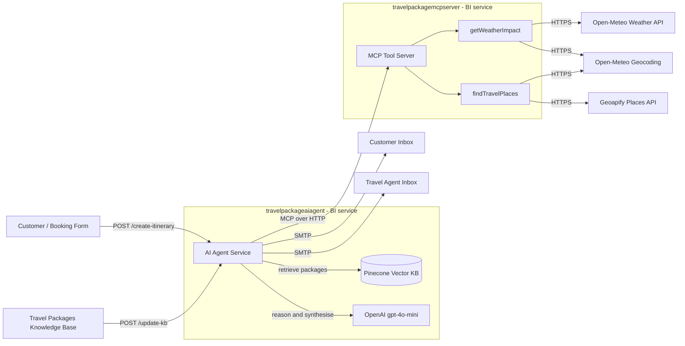

# AI Travel Package Assistant

A demo built with **WSO2 Ballerina Integrator (BI)** and **Devant** showcasing how to compose an agentic AI workflow — RAG, an LLM agent, MCP-served tools, and email delivery — entirely in Ballerina, with no glue code.

---

## Business Use Case

Travel agencies spend hours building personalised itineraries: matching customer interests against internal packages, checking weather, finding real venues, applying margin rules, and writing two emails (one warm and customer-facing, one dense and agent-facing).

This assistant collapses that workflow into a single API call:

1. A customer travel request lands at the agency's intake form.
2. The AI agent retrieves the best-fit internal travel package from the agency's private knowledge base (RAG over Pinecone).
3. It pulls live weather for the travel date and discovers nearby attractions matching the customer's interests.
4. It applies the agency's business rules — budget bands, partner-vendor preferences, weather-driven scheduling, upsell logic.
5. It emails the **customer** a beautifully formatted itinerary and emails the **travel agent** an internal prospect summary with fit score, margin signals, risk flags, and the next action.

The agent never invents packages — every recommendation is grounded in the agency's RAG-indexed playbook.

---

## Solution Architecture



### Two BI projects, one story

| Project | Role | Endpoints |
|---|---|---|
| `travelpackageaiagent` | Hosts the AI agent, RAG ingestion, and email delivery | `POST /TravelItineraryAPI/create-itinerary`, `POST /TravelItineraryAPI/update-kb` |
| `travelpackagemcpserver` | Exposes weather and places as MCP tools the agent can call | `getWeatherImpact`, `findTravelPlaces` |

### Why this layout matters for the demo

- **BI's agentic story** lives in one file — `agents.bal` declares the agent, its memory, its tools, and its model in a few lines.
- **MCP tools as a separate service** demonstrates Devant's service-to-service composition — two independently deployable BI projects connected at runtime.
- **RAG, LLM, and tool calls** all appear as first-class nodes in the BI graphical sequence view.

---

## Tech Stack

- **WSO2 Ballerina Integrator** — `ballerina/ai`, `ballerina/mcp`, `ballerina/http`, `ballerina/email`
- **OpenAI** — `gpt-4o-mini` for reasoning, `text-embedding-3-small` for embeddings
- **Pinecone** — vector store for the agency's internal package knowledge base
- **Geoapify Places API** — real-world attractions, restaurants, parks
- **Open-Meteo** — geocoding and weather forecast
- **SMTP** — itinerary and prospect emails

---

## Project Structure

```
DevantWorkspace/
├── travelpackageaiagent/          # AI agent + RAG + email
│   ├── agents.bal                 # Agent declaration, MCP toolkit, system prompt
│   ├── connections.bal            # Pinecone, OpenAI, SMTP, MCP client
│   ├── functions.bal              # Itinerary orchestration + KB update
│   ├── main.bal                   # HTTP service entry points
│   ├── types.bal                  # Request and response records
│   ├── config.bal                 # configurable secrets
│   ├── files/ReceivedFile.md      # Default packages knowledge base
│   └── Config.toml                # Secrets (gitignored)
│
└── travelpackagemcpserver/        # MCP tools server
    ├── main.bal                   # MCP service listener
    ├── functions.bal              # Weather + places implementations
    ├── connections.bal            # Geocoding, weather, places HTTP clients
    ├── types.bal                  # External API + tool response types
    ├── config.bal                 # GEOAPIFY_API_KEY
    └── Config.toml                # Secrets (gitignored)
```

---

## Prerequisites

- **Ballerina 2201.13.2** or compatible
- **VS Code + Ballerina Integrator extension** (recommended for the graphical view)
- API keys for:
  - OpenAI
  - Pinecone (with an index named `travelpackage` or update the URL in `connections.bal`)
  - Geoapify
- SMTP credentials (Gmail app password, SendGrid, or any SMTP provider)

---

## Configuration

Both projects read secrets from their own `Config.toml`. The files are gitignored — create them locally:

### `travelpackageaiagent/Config.toml`

```toml
[dileepagayan.travelpackageaiagent]
OPEN_AI_KEY    = "sk-..."
PINECONE_KEY   = "pcsk-..."
SMTP_HOST      = "smtp.gmail.com"
SMTP_USERNAME  = "your-sender@example.com"
SMTP_PASSWORD  = "your-app-password"
```

### `travelpackagemcpserver/Config.toml`

```toml
[dileepagayan.travelpackagemcpserver]
GEOAPIFY_API_KEY = "..."
```

> **Security note:** rotate every key after the demo. The keys are in plain text on disk; if your editor or terminal is ever visible during a screen share, they leak.

---

## Running Locally

Two terminals — MCP server first, agent second.

### 1. Start the MCP server (port 8080)

```bash
cd travelpackagemcpserver
bal run
```

You should see `[ballerina/http] started HTTP/WS listener 0.0.0.0:8080`.

### 2. Start the AI agent service

```bash
cd travelpackageaiagent
bal run
```

The default HTTP listener binds to `9090` (Ballerina's `http:getDefaultListener()`).

### 3. Load the knowledge base into Pinecone

The agent grounds every recommendation in `files/ReceivedFile.md`. Ingest it once:

```bash
curl -X POST http://localhost:9090/TravelItineraryAPI/update-kb \
  -H "Content-Type: text/markdown" \
  --data-binary @travelpackageaiagent/files/ReceivedFile.md
```

### 4. Request an itinerary

```bash
curl -X POST http://localhost:9090/TravelItineraryAPI/create-itinerary \
  -H "Content-Type: application/json" \
  -d '{
    "destination": "Las Vegas",
    "travelDate": "2026-05-20",
    "budget": 2000,
    "interests": ["romantic", "shows", "good food"],
    "clientEmail": "jane@example.com",
    "agentEmail": "alex@travelco.com"
  }'
```

The response is a JSON acknowledgement; the customer and the travel agent receive their respective HTML emails shortly after.

---

## API Reference

### `POST /TravelItineraryAPI/create-itinerary`

Generates a personalised itinerary and dispatches both emails.

**Request body**

```json
{
  "destination": "Las Vegas",
  "travelDate": "2026-05-20",
  "budget": 2000,
  "interests": ["romantic", "shows", "good food"],
  "clientEmail": "jane@example.com",
  "agentEmail": "alex@travelco.com"
}
```

**Response (200 OK)**

```json
{
  "status": "success",
  "message": "Itinerary and prospect summary emailed successfully.",
  "clientEmail": "jane@example.com",
  "agentEmail": "alex@travelco.com",
  "destination": "Las Vegas"
}
```

### `POST /TravelItineraryAPI/update-kb`

Re-ingests a markdown knowledge base into Pinecone. Body is the raw markdown file.

---

## Suggested Demo Flow

1. **Open the BI graphical view** for `create-itinerary` — point out the RAG node, the agent node, and the MCP tool nodes.
2. **Show the knowledge base** — open `files/ReceivedFile.md`, scroll through a package, highlight the business rules section.
3. **Ingest the KB live** — POST to `/update-kb`, narrate "the agency just gave the agent its playbook."
4. **Submit a Vegas couple request** — hit `/create-itinerary`. Switch to the inbox on screen; both emails arrive within a few seconds.
5. **Open the client email** — beautifully formatted, customer-friendly.
6. **Open the agent email** — fit score, margin, business rules applied, recommended upsell, risk flags, next action.
7. **Switch destinations** to somewhere not in the KB — show the agent's graceful behaviour (risk flag, no hallucination).
8. **Switch to Devant** — show both BI projects deployed, observability traces of the LLM call, the MCP tool calls, and the SMTP send.

---

## Roadmap

- Multi-day weather forecast (currently single-day per request).
- Per-session memory scoping (avoid cross-prospect context bleed).
- Tracking IDs and a `/itinerary/{id}` polling endpoint.
- Streaming LLM responses for live "thinking" feedback.
- Devant-managed email connector to replace direct SMTP.

---

## Credits

Built by Dileepa Dissanayake, showcasing the WSO2 Ballerina Integrator and Devant.
